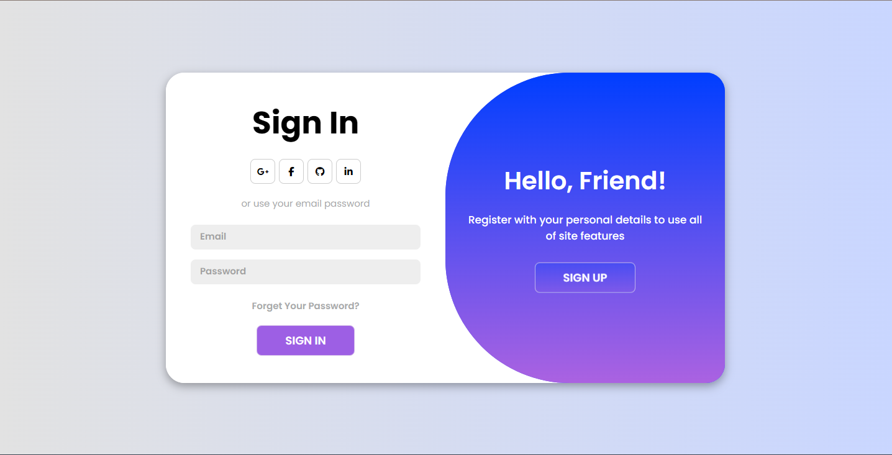

# Login Page in React 

#### This projects aims to put into practice concepts of componentization, hooks and useState.
#### This page contains two forms, one for loggin in and another for registering on the page. This version does not include form validation or request through fetch.
#### The project has a modern design for greater user comfort. The interface displays some ease-in-out animations. The registration section has three fields: Name, Email and Password.
### When we press the SIGN UP button, it activates the keyframes animation to change the section.

## Acess the project through this link 🚀🚀
### https://loginpage-react.vercel.app/

## Projects Notes and Improvements 🪛⚙️
- #### Implement the backend for account and logging into the site 
- #### Add acessibility to the site and responsiveness
- #### And the possibility of being able to log in or create accounts through social buttons  such as Google for example.
>>>>>>> 6c30507 (docs: First version of the readme, description the project)

# React + Vite

This template provides a minimal setup to get React working in Vite with HMR and some ESLint rules.

Currently, two official plugins are available:

- [@vitejs/plugin-react](https://github.com/vitejs/vite-plugin-react/blob/main/packages/plugin-react/README.md) uses [Babel](https://babeljs.io/) for Fast Refresh
- [@vitejs/plugin-react-swc](https://github.com/vitejs/vite-plugin-react-swc) uses [SWC](https://swc.rs/) for Fast Refresh
